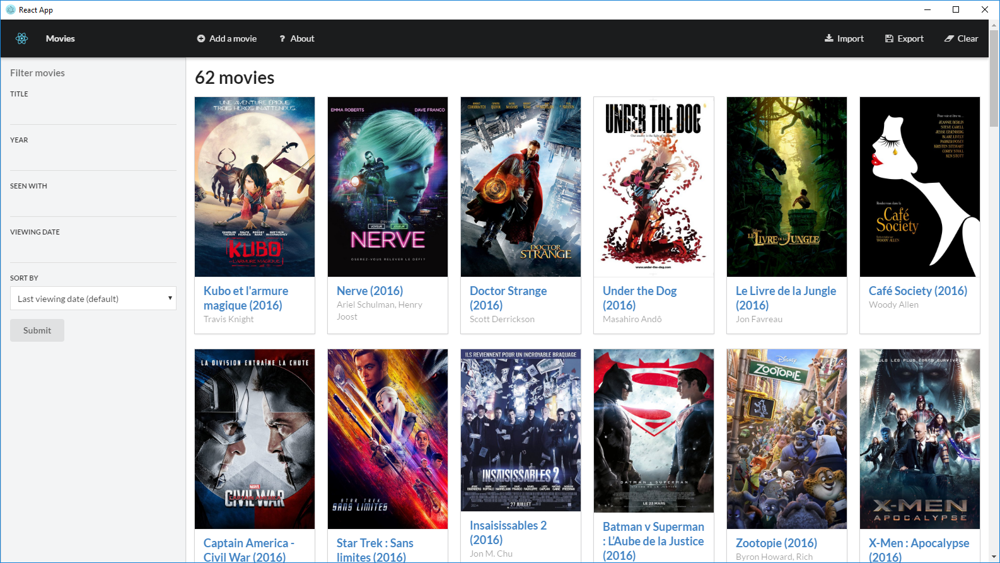

This application's purpose is to allow me to have a list of the movies I've watched and more importantly with whom and when I've watched them.
It's a personal project that I originally didn't intend for it to be used by other people. But as it is totally functional and can work offline as a desktop app, I thought it could be good to share it.

This README focuses primarily on how to build and package the application and is meant to be more like a memo for me than a user guide.
If you have trouble using the applications or wants new functionalities, you are welcome to help, give your advice or open an issue [here](https://github.com/mmorainville/movies-react/issues).



This project was bootstrapped with [Create React App](https://github.com/facebookincubator/create-react-app).

You can find the most recent version of this guide [here](https://github.com/mmorainville/movies-react/blob/master/README.md).

## Table of Contents

- [Available Scripts](#available-scripts)
  - [npm start](#npm-start)
  - [npm run build](#npm-run-build)
- [Deployment](#deployment)
  - [GitHub Pages](#github-pages)
- [Git Commit Guidelines](#git-commit-guidelines)
- [Something Missing?](#something-missing)

## Available Scripts

In the project directory, you can run:

### `npm start`

Runs the app in the development mode.<br>
Open [http://localhost:3000](http://localhost:3000) to view it in the browser.

The page will reload if you make edits.<br>
You will also see any lint errors in the console.

### `npm run build`

Builds the app for production to the `build` folder.<br>
It correctly bundles React in production mode and optimizes the build for the best performance.

The build is minified and the filenames include the hashes.<br>
Your app is ready to be deployed!

## Deployment

### GitHub Pages

>Note: this feature is available with `react-scripts@0.2.0` and higher.

Open your `package.json` and add a `homepage` field:

```js
  "homepage": "https://mmorainville.github.io/movies-react",
```

**The above step is important!**<br>
Create React App uses the `homepage` field to determine the root URL in the built HTML file.

Now, whenever you run `npm run build`, you will see a cheat sheet with instructions on how to deploy to GitHub pages.

To publish it at [https://mmorainville.github.io/movies-react](https://mmorainville.github.io/movies-react), run:

```sh
npm install --save-dev gh-pages
```

Add the following script in your `package.json`:

```js
  // ...
  "scripts": {
    // ...
    "deploy": "gh-pages -d build"
  }
```

Then run:

```sh
npm run deploy
```

Note that GitHub Pages doesn't support routers that use the HTML5 `pushState` history API under the hood (for example, React Router using `browserHistory`). This is because when there is a fresh page load for a url like `http://user.github.io/todomvc/todos/42`, where `/todos/42` is a frontend route, the GitHub Pages server returns 404 because it knows nothing of `/todos/42`. If you want to add a router to a project hosted on GitHub Pages, here are a couple of solutions:
* You could switch from using HTML5 history API to routing with hashes. If you use React Router, you can switch to `hashHistory` for this effect, but the URL will be longer and more verbose (for example, `http://user.github.io/todomvc/#/todos/42?_k=yknaj`). [Read more](https://github.com/reactjs/react-router/blob/master/docs/guides/Histories.md#histories) about different history implementations in React Router.
* Alternatively, you can use a trick to teach GitHub Pages to handle 404 by redirecting to your `index.html` page with a special redirect parameter. You would need to add a `404.html` file with the redirection code to the `build` folder before deploying your project, and you’ll need to add code handling the redirect parameter to `index.html`. You can find a detailed explanation of this technique [in this guide](https://github.com/rafrex/spa-github-pages).

## Git Commit Guidelines

I used the Git Commit Guidelines that Google uses for AngularJS to format my git commit messages. Here is an excerpt of those guidelines.

We have very precise rules over how our git commit messages can be formatted.  This leads to **more readable messages** that are easy to follow when looking through the **project history**.

### Commit Message Format
Each commit message consists of a **header**, a **body** and a **footer**.  The header has a special
format that includes a **type**, a **scope** and a **subject**:

```
<type>(<scope>): <subject>
<BLANK LINE>
<body>
<BLANK LINE>
<footer>
```

The **header** is mandatory and the **scope** of the header is optional.

Any line of the commit message cannot be longer 100 characters! This allows the message to be easier
to read on GitHub as well as in various git tools.

### Revert
If the commit reverts a previous commit, it should begin with `revert: `, followed by the header of the reverted commit.
In the body it should say: `This reverts commit <hash>.`, where the hash is the SHA of the commit being reverted.

### Type
Must be one of the following:

* **feat**: A new feature
* **fix**: A bug fix
* **docs**: Documentation only changes
* **style**: Changes that do not affect the meaning of the code (white-space, formatting, missing
  semi-colons, etc)
* **refactor**: A code change that neither fixes a bug nor adds a feature
* **perf**: A code change that improves performance
* **test**: Adding missing or correcting existing tests
* **chore**: Changes to the build process or auxiliary tools and libraries such as documentation
  generation

### Scope
The scope could be anything specifying place of the commit change. For example `$location`,
`$browser`, `$compile`, `$rootScope`, `ngHref`, `ngClick`, `ngView`, etc...

You can use `*` when the change affects more than a single scope.

### Subject
The subject contains succinct description of the change:

* use the imperative, present tense: "change" not "changed" nor "changes"
* don't capitalize first letter
* no dot (.) at the end

### Body
Just as in the **subject**, use the imperative, present tense: "change" not "changed" nor "changes".
The body should include the motivation for the change and contrast this with previous behavior.

### Footer
The footer should contain any information about **Breaking Changes** and is also the place to
[reference GitHub issues that this commit closes][closing-issues].

**Breaking Changes** should start with the word `BREAKING CHANGE:` with a space or two newlines.
The rest of the commit message is then used for this.

A detailed explanation can be found in this [document][commit-message-format].

[angular-contributing]: https://raw.githubusercontent.com/angular/angular.js/master/CONTRIBUTING.md
[commit-message-format]: https://docs.google.com/document/d/1QrDFcIiPjSLDn3EL15IJygNPiHORgU1_OOAqWjiDU5Y/edit#

## Something Missing?

If you have ideas for more “How To” recipes that should be on this page, [let us know](https://github.com/mmorainville/movies-react/issues).
